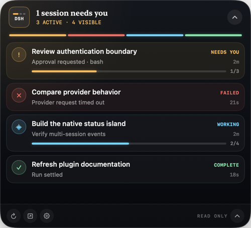

<div align="center">

# DSH Island

**在 macOS 桌面上，用一个轻量“状态岛”查看所有 DeepSeek Harness 会话。**

[English](README.md)



</div>

当多个 [DeepSeek Harness](https://github.com/deepseek-ai/deepseek-harness) Agent 同时运行时，DSH Island 让你回到编辑器工作，同时持续看到哪些会话正在执行、哪些需要你处理、哪些刚刚完成。它是独立的社区项目，不是 DeepSeek 官方产品。

## 功能

- 汇总全部非空会话，实时显示“需要处理、失败、运行中、刚完成、空闲、离线”。
- 收起态仅保留全局结论与多会话信号轨；点击后展开完整列表。
- 显示审批、提问、后台任务、父子 Agent、耗时和当前活动。
- 只有 DSH 发布非空 Todo 投影时才显示确定性进度；其他运行不会编造百分比或 ETA。
- 点击会话可打开 DSH Web；配合可选的社区插件 [dsh-deeplink](https://github.com/qyw233/dsh-deeplink) 可精确定位到该会话。
- 支持悬浮窗位置记忆、所有 Space、菜单栏恢复入口、隐私模式和登录启动。

<div align="center">
  
</div>

## 安装

1. 从 [最新 Release](https://github.com/ChuanTianML/dsh-island/releases/latest) 下载 `DSH-Island-0.1.0-macOS-universal.zip`。
2. 解压后将 **DSH Island.app** 移到“应用程序”。
3. 启动 DSH Web，再打开 DSH Island。默认连接 `http://127.0.0.1:3080`。

```sh
dsh web

# 在 DeepSeek Harness 源码仓库中：
pnpm dsh --profile web
```

0.1 版本使用 ad-hoc 签名，尚未经过 Apple 公证。首次启动时，macOS 可能要求按住 Control 点击应用并选择“打开”。发布包同时支持 Apple 芯片和 Intel Mac，最低系统版本为 macOS 13。

如果 DSH 使用了其他端口，可在设置中修改。默认只允许回环地址；非回环地址必须显式开启，并且只能连接你信任的 DSH Host。

## 进度语义

DSH 没有为所有 Agent 任务提供统一百分比或 ETA，因此本项目明确区分“运行状态”和“任务进度”：

| 数据来源 | 展示方式 |
| --- | --- |
| `session.list` / `host/session-status` | 权威运行状态 |
| 非空 `todos` 投影 | 已完成数 / 总数与确定性进度轨 |
| 会话事件 | 推理、写作、编辑文件等描述性阶段 |
| 没有 Todo 投影 | 不确定性运行指示，不显示虚假百分比或 ETA |

连接正常时的优先级是“需要处理 → 失败 → 运行中 → 刚完成 → 空闲”；基线请求失败时，全局状态变为离线。

## 隐私与安全

- 首个版本完全只读，不会审批、回答、控制或编辑会话。
- 隐私模式在状态引擎输出前替换标题，并隐藏 Todo 文本、未知工具名、错误和连接细节。
- 工具参数不会进入展示状态。
- 不包含统计分析、遥测、云中继、凭据存储或模型上下文注入。

DSH 本身具备强大的 Agent 执行能力，不要把未经认证的 DSH Host 暴露到不可信网络。

## 开发

需要 macOS 13+，以及 Xcode 16 或兼容的 Swift 6 工具链。

```sh
swift test
swift build -c release -Xswiftc -strict-concurrency=complete -Xswiftc -warnings-as-errors
./scripts/build-app.sh
```

可在没有 DSH Host 的情况下运行确定性视觉演示：

```sh
swift run dsh-island --demo-expanded
```

详细说明见[产品设计](docs/product-design.md)、[技术架构](docs/architecture.md)和 [0.1 本机验证记录](docs/validation.md)。项目使用 [MIT License](LICENSE)。
